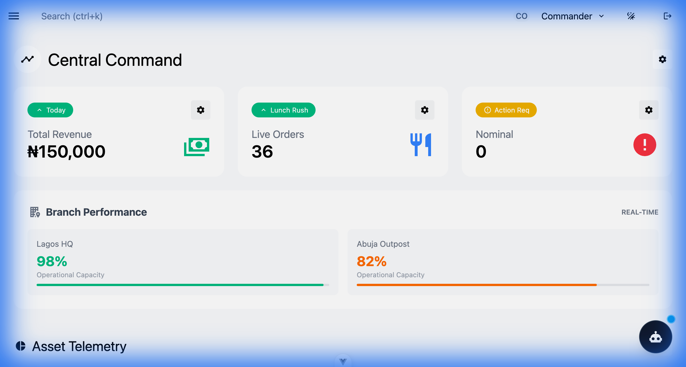
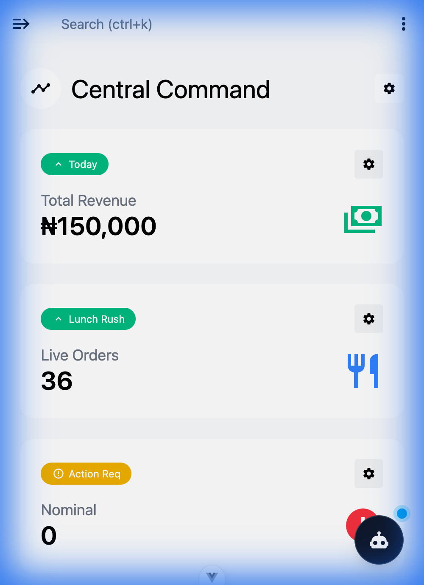
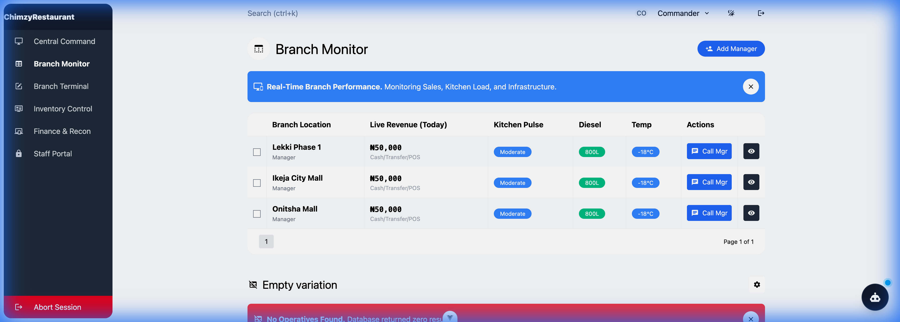
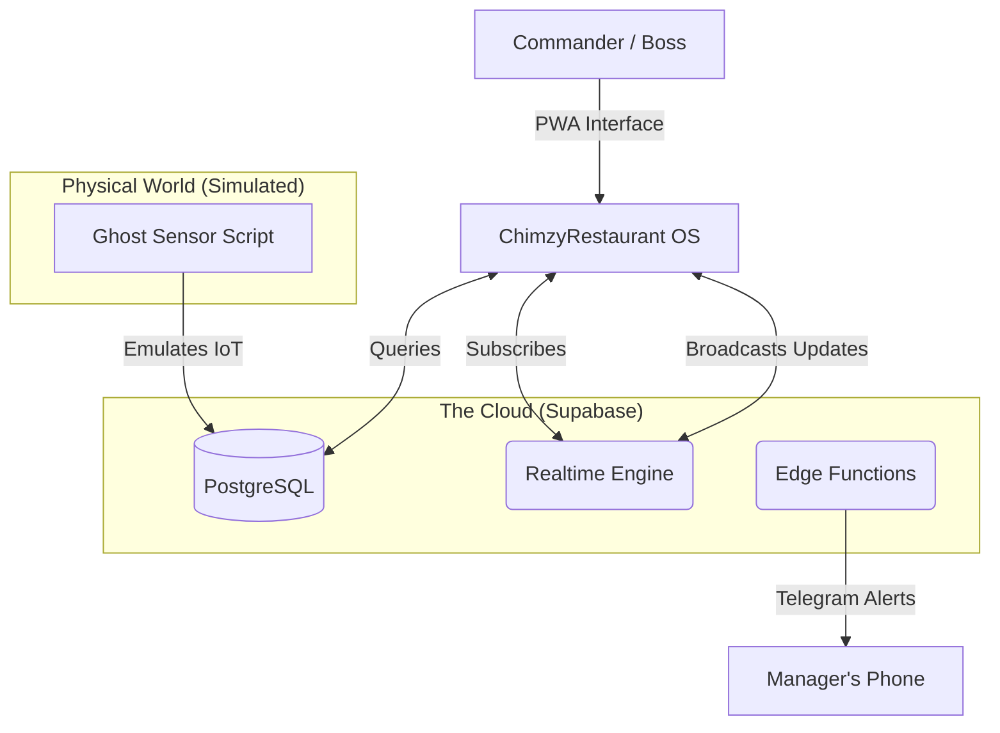

<div align="center">

# 🦅 ChimzyRestaurant OS
### The Operating System for Modern Restaurant Empires
**Command. Control. Conquer.**

[](https://vuejs.org/)
[](https://tailwindcss.com/)
[](https://supabase.com/)
[](https://web.dev/progressive-web-apps/)

> [!NOTE] 
> For a detailed walkthrough of all modules, check the [User Guide](docs/GUIDE.md).

</div>

---

## ⚡ System Intelligence

**ChimzyRestaurant OS** is not just a dashboard; it is a **neural interface** for managing multi-branch restaurant operations in high-latency environments (specifically engineered for the Nigerian infrastructure context). 

It fuses **Sales Data**, **IoT Telemetry** (Generator Fuel, Cold Chain), and **Staff Operations** into a single glass-pane view, powered by a "Ghost" simulation engine for robust testing.

## 🛠 The 2026 Tech Stack

Unapologetically modern. Built for speed, scale, and "wow" factor.

*   **Core**: [Vue 3](https://vuejs.org/) (Composition API) + [Vite](https://vitejs.dev/) (Instant HMR)
*   **State**: [Pinia](https://pinia.vuejs.org/) (Reactive centralized store)
*   **Styling**: [Tailwind CSS v4](https://tailwindcss.com/) (JIT engine, utility-first)
*   **Backend & Realtime**: [Supabase](https://supabase.com/) (PostgreSQL + WebSockets)
*   **Edge Logic**: Supabase Edge Functions (Deno Runtime)
*   **Intelligence**: **Commander AI** (Context-aware Assistant Interface)
*   **Infrastructure**: **"Ghost" Sensor Network** (Simulated IoT Hardware Layer)
*   **Deployment**: PWA (Progressive Web App) with Service Workers

## 🚀 Key Modules

### 1. Central Command Dashboard
**The Nerve Center.** Real-time aggregation of sales, diesel levels, and system alerts.

<div align="center">
    
</div>
<br/>

<div align="center">
    
</div>

*   **Live Aggregation**: Real-time sales data streaming from all branches.
*   **Interactive Trends**: Dynamic filtering for "Lunch Rush", "Dinner Service", and historical lookbacks.
*   **"No Data" Grace handling**: Smart UI states for missing data periods.

### 2. Live Branch Monitor
**Operational Awareness.** Granular view of each branch's performance and connectivity status.

<div align="center">
    
</div>

### 3. Branch Terminal (Forms)
**Data Entry Point.** Interface for managers to submit closing reports, inventory counts, and incidents.

<div align="center">
    
</div>

### 4. IoT "Ghost" Telemetry
*   **Hardware Simulation**: A Node.js script (`ghost_sensor.js`) acts as a virtual hardware layer, pushing synthetic sensor data to the cloud.
*   **Fuel Monitoring**: Tracks diesel levels in liters across branch generators.
*   **Cold Chain Defense**: Mocks temperature sensors in freezers (-20°C to -15°C) to prevent spoilage.

### 3. Financial Recon
*   **Cash vs. Digital**: Dedicated reconciliation interfaces for cash-heavy operations.
*   **Payment Split Analysis**: Visual breakdown of Transfer vs. POS vs. Cash.

### 4. Commander AI 🤖
*   **Context Awareness**: Knows the *current* state of the restaurant (revenue, fuel alerts).
*   **Natural Language**: "How is Lekki performing?" translates to real database queries.
*   *(Current Status: Heuristic Mock / Ready for LLM Injection)*

## 🏗 Architecture



## 🔋 "Ghost" Sensor Engine

The project includes a sophisticated hardware simulator located at `./ghost_sensor.js`. This script breathes life into the dashboard during demos.

**Capabilities:**
*   Simulates 3 distinct restaurant branches (Lekki, VI, Ikeja).
*   Random walks "Diesel Levels" (simulating consumption).
*   Injects random "Order Events" (simulating POS activity).
*   Simulates "Temperature Fluctuation" (simulating compressor cycles).

## 📦 quick_start_protocols

### Prerequisites
*   Node.js v20+
*   Supabase Account (Free Tier is sufficient)

### 1. Clone & Install
```bash
git clone https://github.com/chimzyfire-ship-it/ResturantOS.git
npm install
```

### 2. Ignite the Interface
```bash
npm run dev
```
*Access the Command Deck at `http://localhost:5173`*

### 3. Summon the Ghosts (Simulation)
Open a new terminal to start the data stream:
```bash
npm run simulate
# Watch as the dashboard comes alive with real-time data ingestion.
```

## 🔐 Security & Access
*   **RBAC**: Role-Based Access Control (Manager vs. Staff vs. HQ).
*   **Audit Trails**: Non-repudiation logging for financial reconciliation.

---

<div align="center">

**Built by ChimzyFire**
*Engineering the Future of African Hospitality Tech.*

&copy; 2026

</div>
